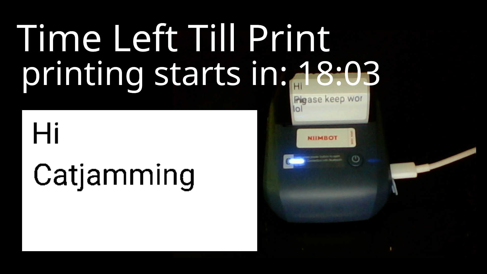

# Niimbot & Twitch printing stream!

This is a project where the idea is to create a twitch stream that allows people to chat and based on the chat messages labels will be printed.

## Tech Stack

1. Messaging - Twitch IRC
2. Label Printing - Niimbot & Custom Made library based on [NiimBlue](https://github.com/MultiMote/niimbluelib) as reference implementation of niimbot's printers
3. Custom Framebuffer Drawing Library using MiniFB and AB_Glyph.
4. Text Extraction - OpenAI's GPT-4-MINI



## Utilities

So i made a couple never before made crates afaik.
You can "install" these crates by just copying over the files this is by far the most reliable way. Just add a tiny notice above the files saying you got it from this repo :).

Alternative method:
You can add this to your Cargo.toml

```toml
[dependencies]
niimbot = {git="https://github.com/Tricked-dev/printer-livestream"}
circe ={git="https://github.com/Tricked-dev/printer-livestream"}
ntfy = {git="https://github.com/Tricked-dev/printer-livestream"}
```

I will provide minimal support for people using these crates but feel free to open an issue if you have any problems.

## How to run

1. Good Luck lol this Niimbot printer is unreliable AF

---

Ok so you are daring?
Here we go

1. Create a config.json file in your PWD it should include these fields, see [1](#twitch) for twitch

```json
{
  "openai_api_key": "",
  "irc_token": "oauth:SECRET",
  "irc_channel": "#username",
  "irc_username": "",
  "width": 400, // Round these to nearest 8 btw remove this comment cause json parser is pretty strict :)
  "height": 240,
  "clock_time": 30,
  "notify_url": "Optional insert full ntfy url here",
  "set_shutdown_timer": 4 // Would probably set this to 4 otherwise printer will shutdown pretty quickly after the program crashes and heartbeats stop :)
}
```

[Full config spec](https://github.com/Tricked-dev/printer-livestream/blob/main/src/config.rs) can be found here

2. Run the program

A white window will open and after that you can type in chat in the following format `text x,y` ai will parse other patterns too but this one is the most reliable

3. Setup obs

The countdown is placed in `timer.txt` in PWD when this program starts and as you might guess it counts down use this as text source in obs to get a live countdown.
And obviously place the window this program spawns in obs too.
You might also want to add a webcam and setup obs stream credentials
Good luck yet again!

### Twitch

<https://twitchapps.com/tmi/>
